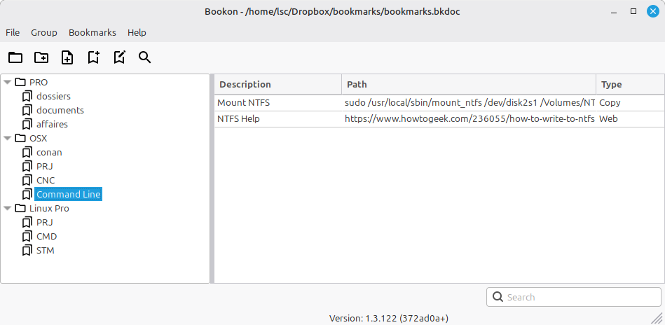

# Bookon

Bookon is a desktop bookmark manager built with wxWidgets. It stores groups of bookmarks in `.bkdoc` files and lets the user organize them in a tree structure.



Each bookmark has a description, a target value, and an action type:

- `Open`: opens a local file or document with the system default application.
- `Web`: opens a URL in the system default browser.
- `Copy`: copies the configured value to the clipboard.

The main window is split into a folder tree and a bookmark list. Users can create groups, add entries, edit or remove bookmarks, search from the toolbar/menu, drag bookmarks between entries, and use the recent-files menu to reopen documents. The application stores its data with Protocol Buffers.

## Building

Bookon uses CMake and Conan 2. A C++17 compiler is required.

### Requirements

- CMake 3.20 or newer
- Conan 2.x
- A C++17 compiler
- Python and pip, if Conan is installed through pip

Install Conan if needed:

```bash
python -m pip install --upgrade pip
python -m pip install "conan>=2,<3"
```

Create or refresh the default Conan profile:

```bash
conan profile detect --force
```

### Configure Dependencies

From the repository root:

```bash
conan install . \
  -s build_type=Release \
  -s:h compiler.cppstd=17 \
  -s:b compiler.cppstd=17 \
  --build=missing \
  -r=conancenter
```

This installs the required dependencies from ConanCenter and generates the CMake presets under `build/Release/generators`.

On Linux, Conan may need system packages for GTK/X11 dependencies. If the package manager integration is required, use:

```bash
conan install . \
  -s build_type=Release \
  -s:h compiler.cppstd=17 \
  -s:b compiler.cppstd=17 \
  -c tools.system.package_manager:mode=install \
  -c tools.system.package_manager:sudo=True \
  --build=missing \
  -r=conancenter
```

### Build

```bash
cmake --preset conan-release
cmake --build --preset conan-release
```

The executable is generated in `build/Release`.

### Run Tests

```bash
ctest --test-dir build/Release --output-on-failure
```

### Create Packages

After building, CPack can generate platform packages from the build directory:

```bash
cd build/Release
cpack
```
